# Admin Dashboard

if you are looking for a project where you can learn React, Role based
authentication, Redux Toolkit Query, React routing , React router 6,
React Protected route, User authentication and so much more then this
project is best option

##### I worked on this project for my fiver client. Please checkout my fiverr account if you want to hire me

- [Find me on fiver ](https://www.fiverr.com/zainbinramzan/develop-web-applications-with-mern-stack-react-node-express-moongodbplugin-react/README.md)
- [Find me on linkedin](https://www.linkedin.com/in/abu-zain-html-css-javascipt-developer/)

##### Technologies used React + TypeScript + Vite + Redux + RTQ

### Overview Page

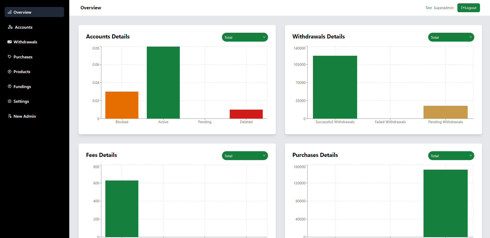

### Accounts Page

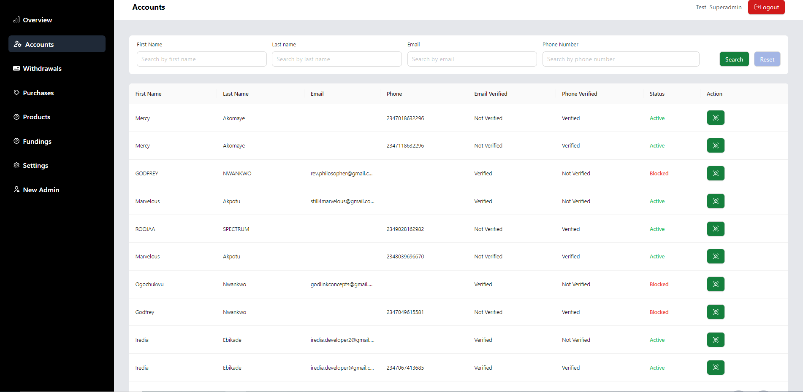

### Singal Account Details Page Drawer

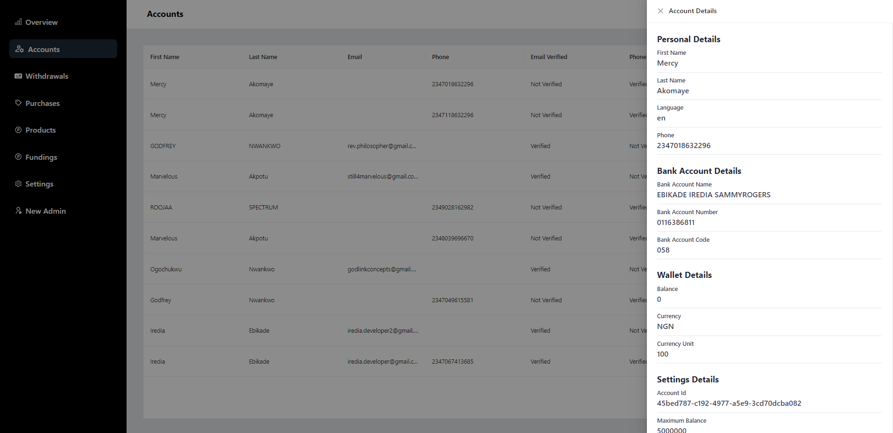

### Withdrawals Page

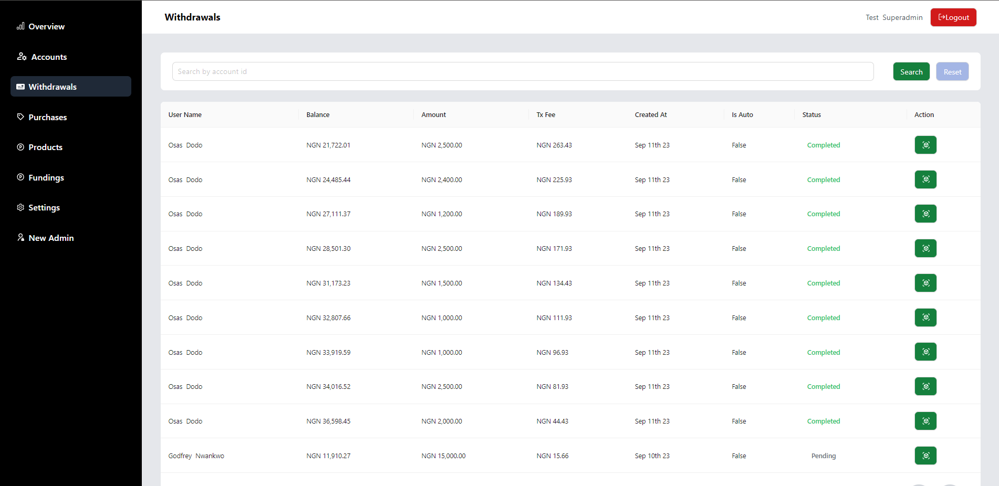

### Singal Withdrawal Details Drawer

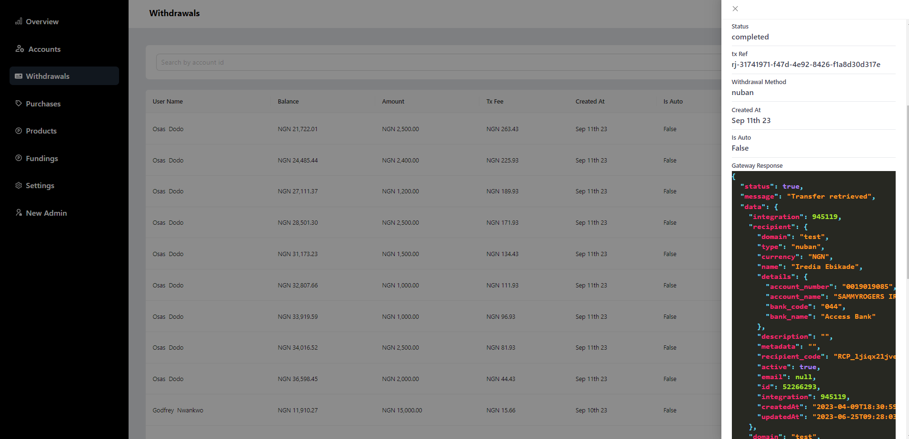

### Purchases Page

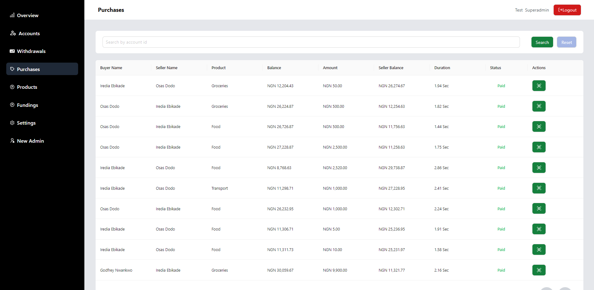

### Singal Purchase Details Drawer

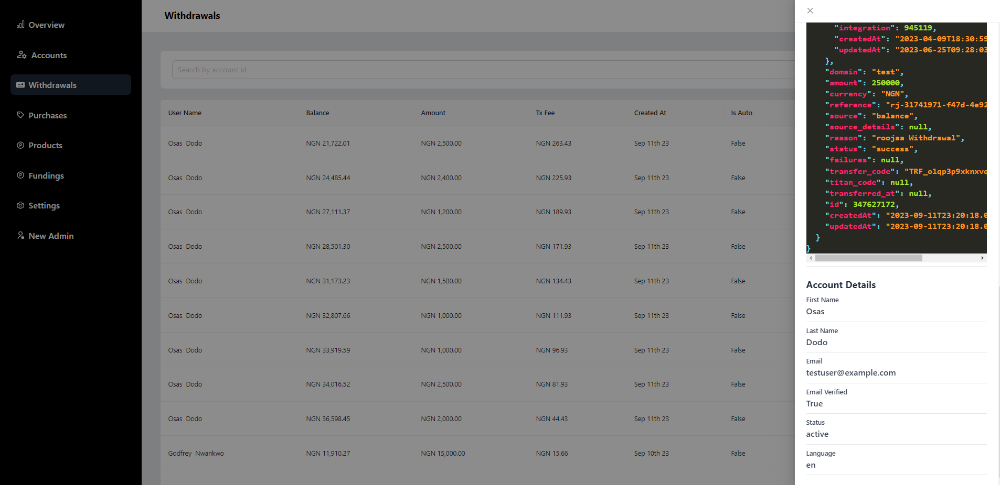

### And / Update Product Details Drawer

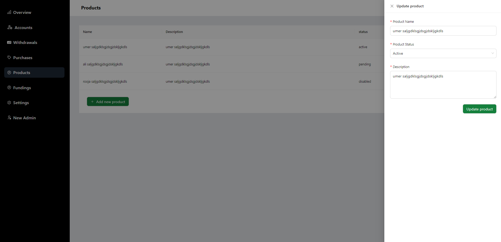

### Fundings Page

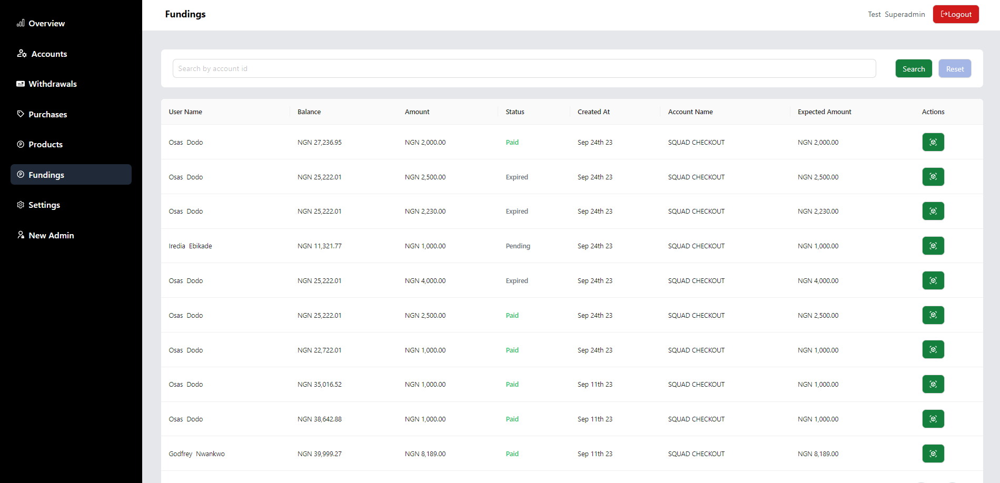

### Singal Fundings Details Drawer

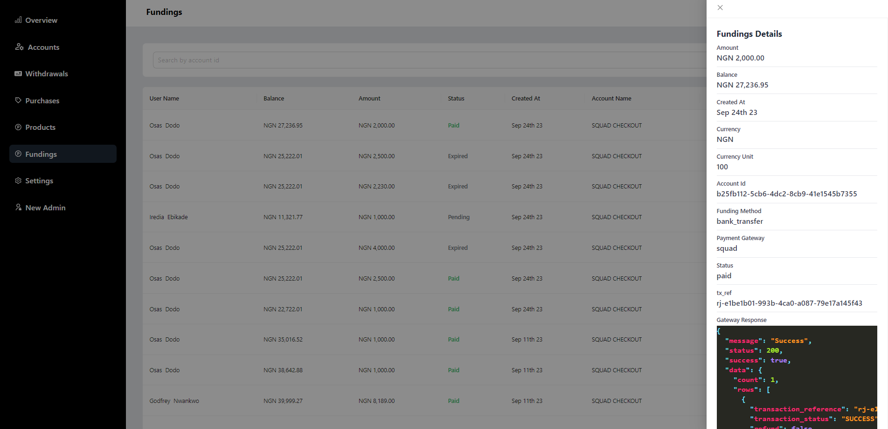

### Settings Page

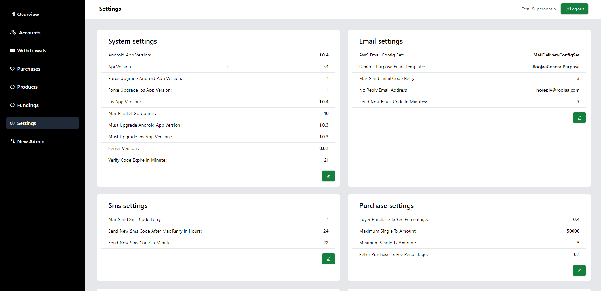

### Update Setting Page

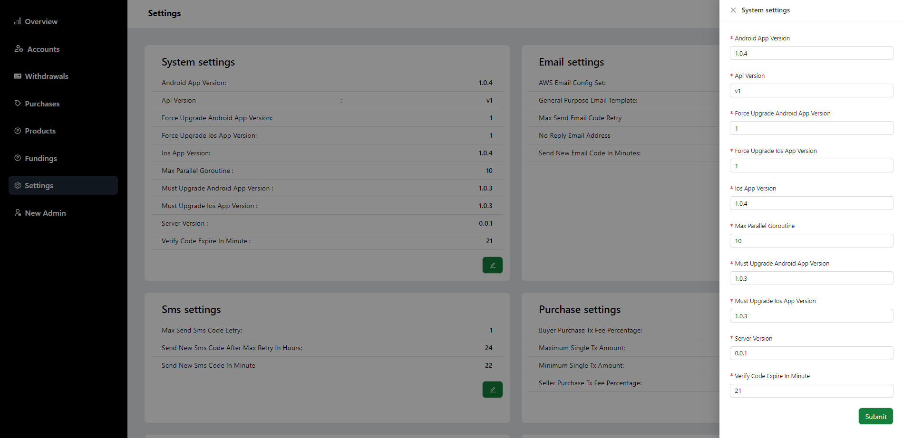

### New Admin Page

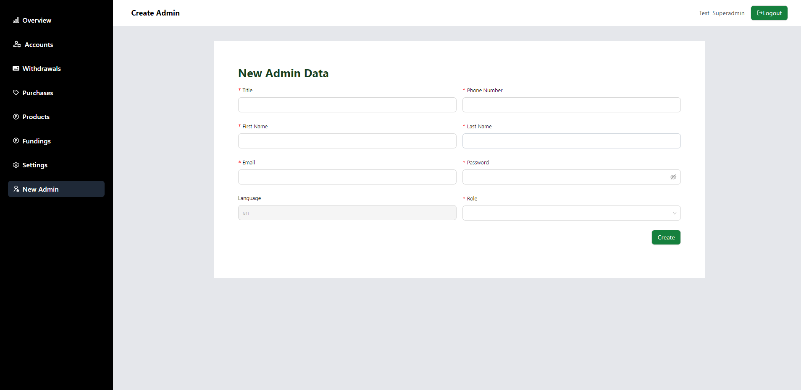

### Login Page

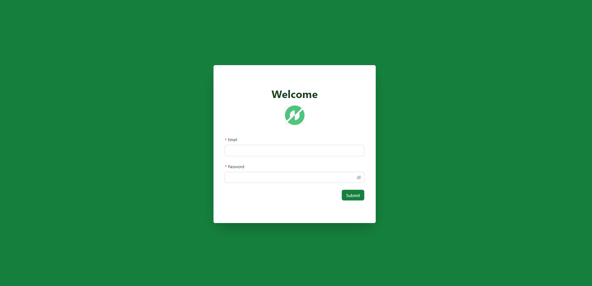
